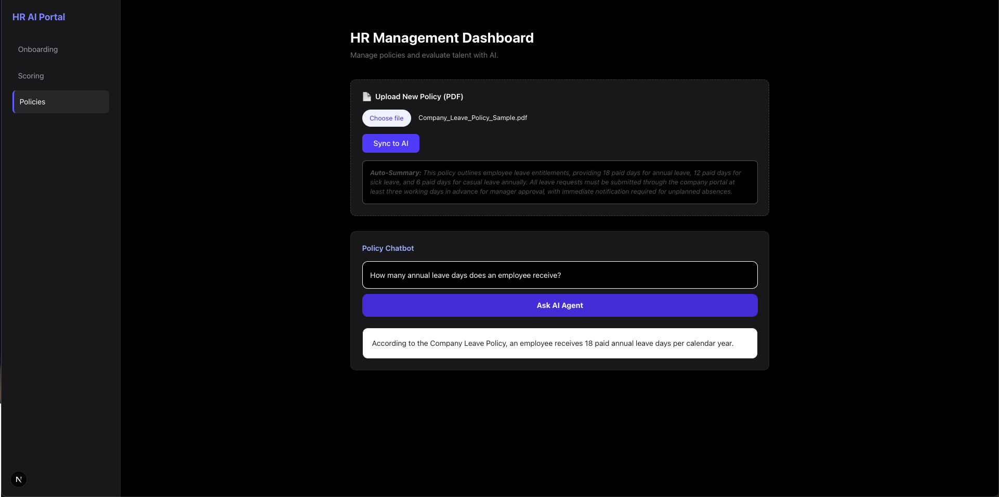
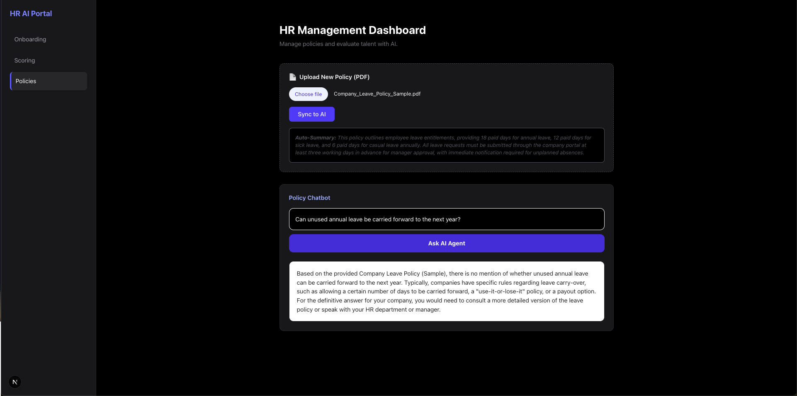
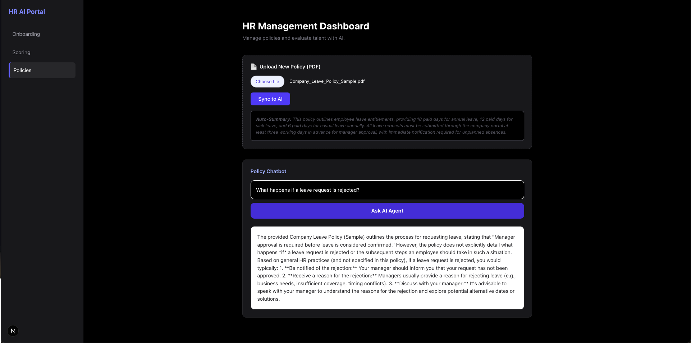
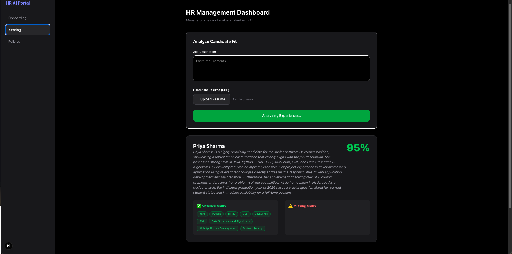
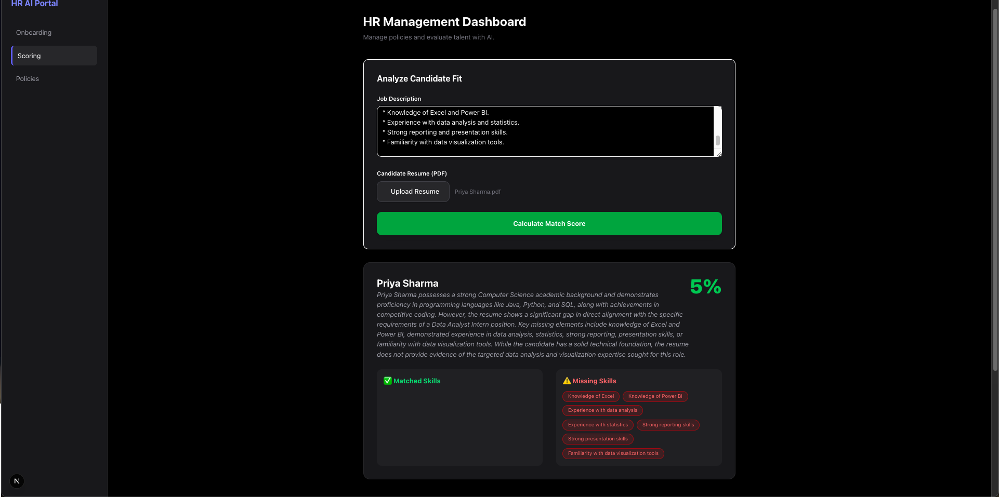
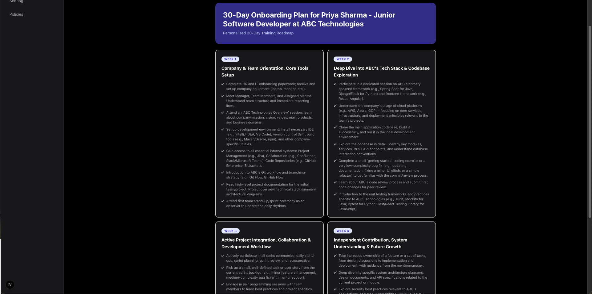
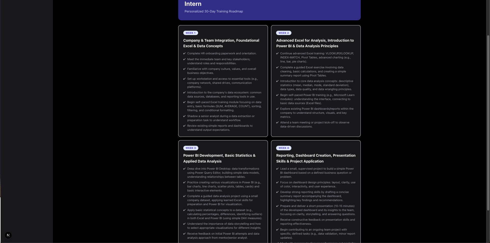

<div align="center">

# AI-Powered HR Management Portal

**A full-stack HR automation platform built with Next.js 15 and Google Gemini.**

Policy document Q&A over your own PDFs · Resume-to-JD skill scoring · AI-generated onboarding roadmaps


Built for the **Build2Break Hackathon**

</div>

---

## Screenshots

### Policy Q&A Bot

<table>
<tr><td colspan="2"><b>Correct responses from the policy PDF</b> when the question's context is present in the document</td></tr>
<tr>
<td></td>
<td></td>
</tr>
<tr><td colspan="2"><b>Correctly responds "not mentioned in the policy document"</b> when the question's context is absent from the document</td></tr>
<tr>
<td></td>
<td></td>
</tr>
<tr><td colspan="2"><b>Handles a hallucination-inducing question correctly</b></td></tr>
<tr>
<td></td>
<td></td>
</tr>
</table>

### Resume Scoring Engine

<table>
<tr><td><b>Resume is highly relevant to the applied job role</b></td></tr>
<tr><td></td></tr>
<tr><td><b>Resume is not relevant to the applied job role</b></td></tr>
<tr><td></td></tr>
</table>

### Onboarding Roadmap Generator

<table>
<tr><td><b>Resume is highly relevant to the applied job role</b></td></tr>
<tr><td></td></tr>
<tr><td><b>Resume is not relevant to the applied job role</b></td></tr>
<tr><td></td></tr>
</table>

---

## Core Modules

| Module | What it does |
|---|---|
| **Knowledge Base (RAG)** | Upload internal HR policy PDFs. The app extracts and summarizes the text, generates vector embeddings, and stores them in MongoDB Atlas for semantic search. |
| **Skill Scoring Engine** | Analyzes a candidate resume against a job description to produce a match percentage, matched/missing skills, and key highlights. |
| **Talent Pool Management** | A persistent, searchable database of every candidate that's been scored, with delete support. |
| **Onboarding Module** | Turns a candidate's identified skill gaps into a structured 30-day training roadmap. |

---

## Tech Stack

| Layer | Technology |
|---|---|
| Framework | Next.js 15 (App Router) |
| AI Engine | Google Gemini — `gemini-2.5-flash` for text generation, `gemini-embedding-001` for vector embeddings |
| Database | MongoDB Atlas (with Atlas Vector Search) |
| PDF Processing | pdf2json |
| Styling | Tailwind CSS v4 |

---

## Environment Variables

Copy `.env.local.example` to `.env.local` and fill in:

| Variable | Description |
|---|---|
| `MONGODB_URI` | Your MongoDB Atlas connection string (no port number in `mongodb+srv://` URIs) |
| `GEMINI_API_KEY` | Your Google AI Studio API key |

---

## Project Structure

```
app/
  api/
    onboarding/       # 2-week & 30-day onboarding plan generation
    policies/         # PDF upload + RAG chat
    skills/           # Resume scoring, talent pool list/delete
  page.tsx            # Single-page dashboard (Policies / Scoring / Onboarding tabs)
lib/
  gemini.ts           # Gemini text generation + embeddings
  mongodb.ts          # Cached MongoDB client
```
